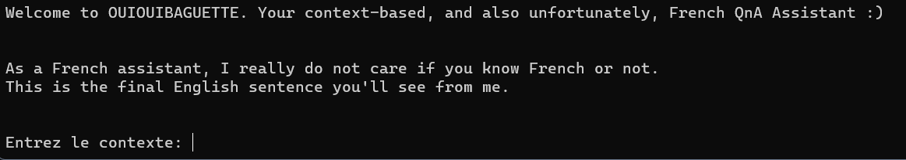
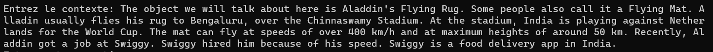
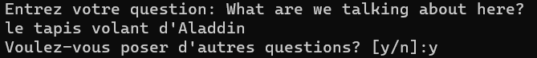
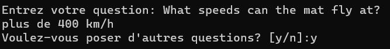
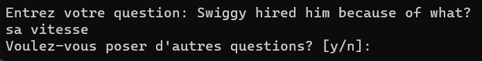
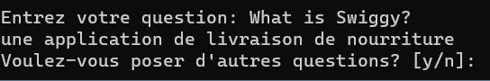
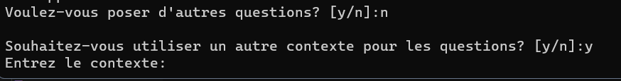
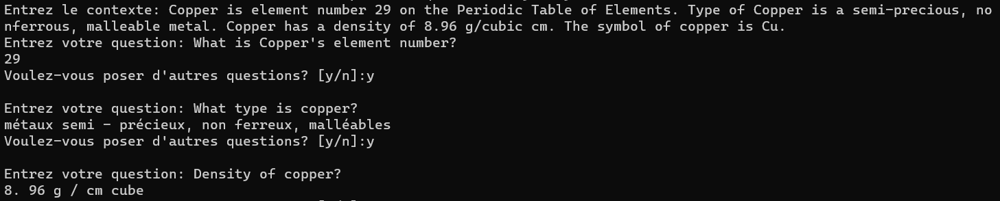
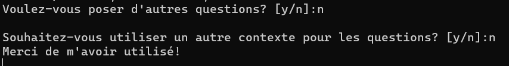

# OUIOUIBAGUETTE: An Unfortunately French, Context-based QnA Assistant

## Models Used:
1.  ### DistilBERT
- This project utilizes DistilBERT for question answering tasks. DistilBERT is a smaller, distilled version of BERT, designed for more efficient use of resources without compromising performance.
- DistilBERT retains much of BERT's language understanding capabilities. While it may not outperform BERT on every benchmark, it offers a strong trade-off between model size and performance.
2. ### MBart50
- This project utilizes MBart50 for translation tasks. MBart50 is part of Facebook's M2M (Many-to-Many) translation model series, designed for multi-language translation tasks. 
- It has been fine-tuned on a large-scale dataset, making it capable of providing accurate and contextually relevant translations.
- Advantage of using MBart50 here is that we can seamlessly just change 2 lines of code to change the source language and the target language (OUIOUIBAGUETTE could have been DHOKLAFAFDA a Gujarati assistant).

## Important Translations:
- Entrez le contexte = Enter the context
- Entrez votre question = Enter your question
- Voulez-vous poser d'autres questions? = Do you want to ask any further questions?
- Souhaitez-vous utiliser un autre contexte pour les questions? = Would you like to use another context for the questions?
- Merci de m'avoir utilisé! = Thanks for using me!

## Example Implementations:
Note: One drawback of the system could be that it is only runnable on CLI, another could be that it takes time for the mode to load when you run the program for the first time on the CLI (in your python environment).

### Welcome:

### Entering the context:

### Asking questions:

### Switching context:

### Exit:
